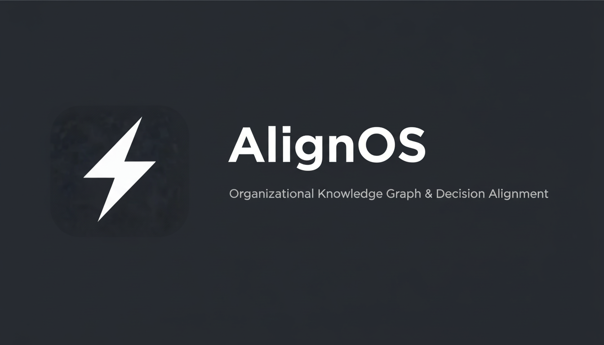

# AlignOS

**Organizational Knowledge Graph & Decision Alignment Platform**

AlignOS is an enterprise-grade system for capturing, organizing, and propagating organizational knowledge. It transforms unstructured information into a living knowledge graph, tracks decisions, monitors alignment across teams, and surfaces conflicts before they become problems.



## Features

### 🎯 Command Center
Real-time organizational dashboard with AI-powered querying, activity feeds, and key metrics at a glance.

### 📥 Intelligent Ingest
- **Text Input**: Paste meeting notes, transcripts, or documents
- **File Upload**: Support for .txt, .md, and .pdf files (including scanned PDFs with OCR)
- **Voice Recording**: Speak naturally and have content transcribed automatically
- **AI Extraction**: Automatically extract decisions, people, projects, and relationships

### 🕸️ Knowledge Graph
Interactive visualization of your organizational entities and their relationships:
- **People**: Team members and stakeholders
- **Teams**: Departments and working groups
- **Projects**: Active initiatives and workstreams
- **Decisions**: Documented choices and their rationale

Drag between nodes to create connections. Filter by entity type. Search across all entities.

### 📚 Decision Ledger
Track every decision with full version history:
- Status tracking (Draft, Active, Superseded, Deprecated)
- Rationale documentation
- Version history with change summaries
- Stakeholder acknowledgment tracking

### 📡 Propagation & Awareness
Monitor how decisions spread across your organization:
- Track who has acknowledged each decision
- Identify stuck propagations
- Visualize awareness gaps
- Ensure alignment before conflicts arise

### ⚠️ Conflict Detection
Automatic detection of organizational issues:
- **Duplicates**: Same decision documented multiple times
- **Contradictions**: Conflicting decisions or information
- **Timeline Mismatches**: Scheduling or sequencing conflicts
- **Ownership Overlaps**: Unclear responsibility
- **Stale Decisions**: Outdated information needing review

### 🎙️ AI Voice Assistant
Conversational AI agent powered by ElevenLabs for hands-free organizational queries.

## Tech Stack

- **Frontend**: React 18, TypeScript, Vite
- **Styling**: Tailwind CSS, shadcn/ui components
- **Animations**: Framer Motion
- **Visualization**: D3.js for knowledge graph
- **Backend**: Supabase (Database, Auth, Edge Functions)
- **AI**: OpenAI/Gemini for extraction and queries
- **Voice**: ElevenLabs for conversational AI, Whisper for transcription

## Getting Started

### Prerequisites
- Node.js 18+ (recommended: use [nvm](https://github.com/nvm-sh/nvm))
- npm or bun

### Installation

```bash
# Clone the repository
git clone <YOUR_GIT_URL>

# Navigate to project directory
cd alignos

# Install dependencies
npm install

# Start development server
npm run dev
```

The app will be available at `http://localhost:5173`

### Environment Variables

The project uses Lovable Cloud for backend services. Environment variables are automatically configured:

- `VITE_SUPABASE_URL` - Supabase project URL
- `VITE_SUPABASE_PUBLISHABLE_KEY` - Supabase anon key

For AI features, ensure the following secrets are configured in your Lovable project:
- `ELEVENLABS_API_KEY` - For voice agent functionality
- `LOVABLE_API_KEY` - For AI extraction and queries (auto-provisioned)

## Project Structure

```
src/
├── components/
│   ├── graph/          # Knowledge graph visualization
│   ├── layout/         # App layout and navigation
│   ├── shared/         # Reusable components (MetricCard, QuickInput, VoiceAgent)
│   └── ui/             # shadcn/ui components
├── hooks/              # Custom React hooks
├── pages/              # Route components
│   ├── Index.tsx       # Command Center dashboard
│   ├── Ingest.tsx      # Information ingestion
│   ├── Graph.tsx       # Knowledge graph
│   ├── Ledger.tsx      # Decision ledger
│   ├── Propagation.tsx # Awareness tracking
│   └── Conflicts.tsx   # Conflict management
├── integrations/       # Supabase client and types
└── types/              # TypeScript type definitions

supabase/
└── functions/          # Edge functions
    ├── extract-entities/   # AI entity extraction
    ├── extract-pdf/        # PDF text extraction
    ├── query-ai/           # AI query handling
    ├── transcribe/         # Voice transcription
    └── elevenlabs-conversation-token/  # Voice agent auth
```

## Design Philosophy

AlignOS follows a **minimalist, enterprise-grade aesthetic** inspired by Linear, Notion, and Vercel:

- **Calm & Precise**: High-signal, low-noise interface
- **Monochrome with Status Accents**: Clean grayscale with purposeful color for status
- **Subtle Animations**: Smooth micro-interactions that feel professional
- **Glassmorphism**: Subtle depth through blur and transparency

## Deployment

### Via Lovable
1. Open your project at [lovable.dev](https://lovable.dev)
2. Click **Share → Publish**
3. Your app is live!

### Custom Domain
Connect your own domain in **Project → Settings → Domains**

## Contributing

This project is built and maintained through Lovable. To contribute:

1. Fork the project
2. Make changes via Lovable or your preferred IDE
3. Submit a pull request

## License

MIT License - See [LICENSE](LICENSE) for details.

---

Built with ❤️ using [Lovable](https://lovable.dev)
